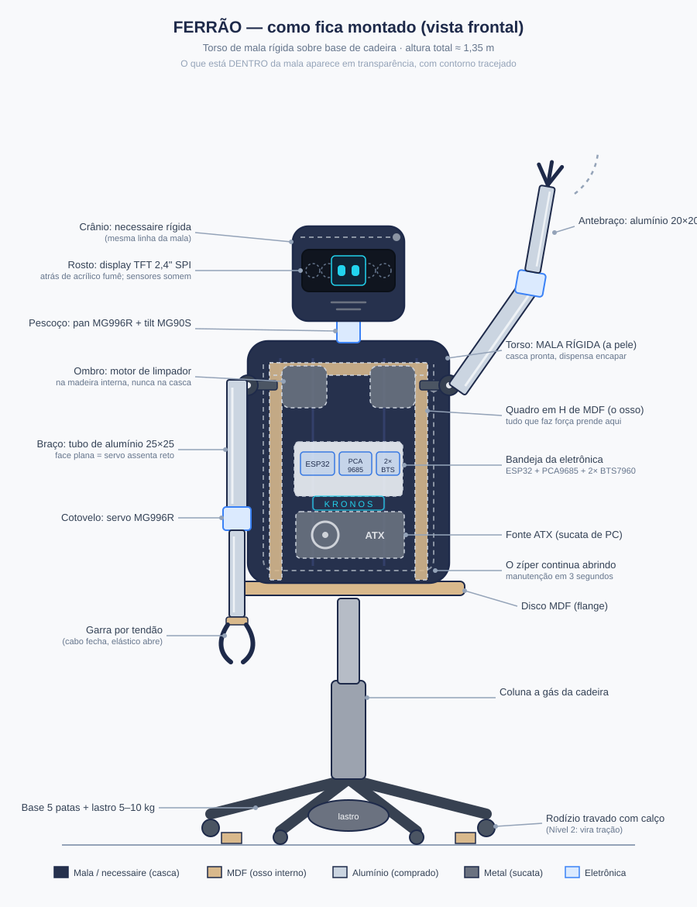
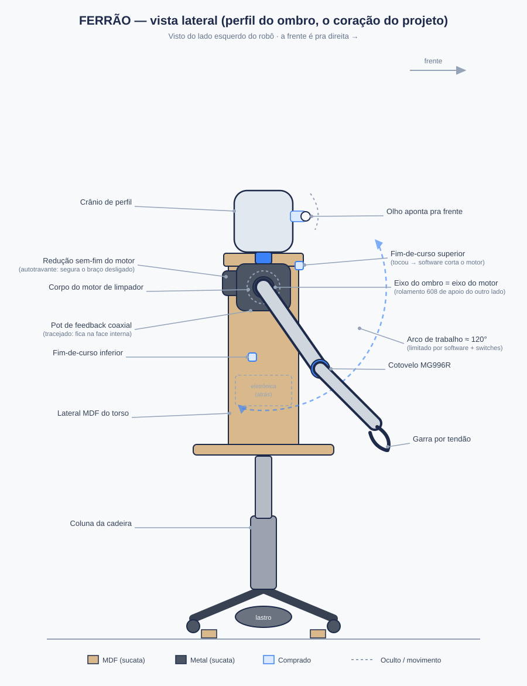
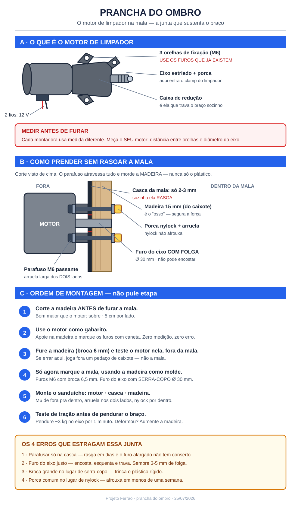
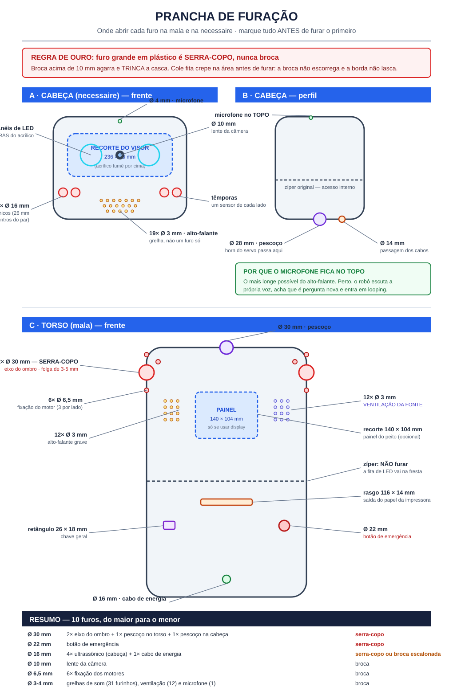
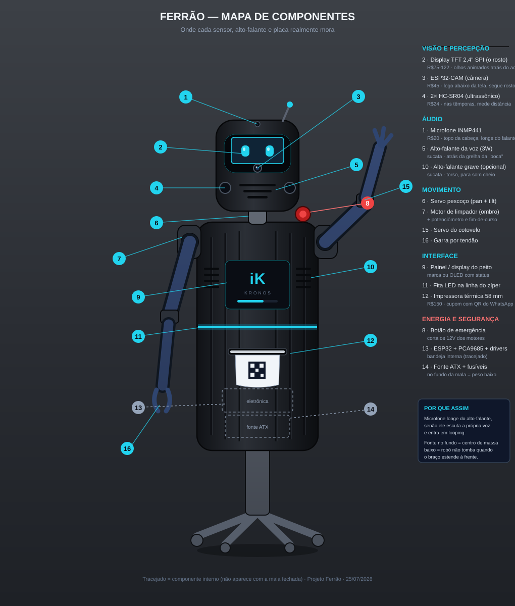

# Projeto "Ferrão" — Robô humanoide de sucata

**Documento técnico completo — v1.0 (25/07/2026)**
Construível por uma pessoa, em casa, com furadeira + chaves + alicate + Dremel. Sem impressora 3D, sem solda de metal, sem oficina.

---

## 0. Veredito de ambição (a parte honesta)

### A escada de níveis

| Nível | O que é | Viável pra você hoje? |
|---|---|---|
| 0 | Busto estático com cabeça que gira e "olha" | Sim — fácil demais, você enjoaria em 2 semanas |
| 1 | Torso humanoide em base fixa: cabeça sensorial + 2 braços articulados + garra | **Sim — é este o projeto** |
| 2 | Nível 1 sobre base com rodas (dirige pela casa) | Sim, como **fase de expansão** depois do nível 1 pronto |
| 3 | Pernas que "andam" apoiado (marcha estática, tipo bonequinho lento) | No limite — exige usinagem de precisão que Dremel não entrega |
| 4 | Humanoide bípede que anda de verdade | **Não. Nem com orçamento 10x maior.** |

### Por que andar está fora (o porquê de verdade, não desânimo)

Andar em duas pernas **não é um problema de força — é um problema de equilíbrio em tempo real**. A analogia: equilibrar um cabo de vassoura na palma da mão. Você consegue, porque seu olho mede a inclinação e sua mão corrige dezenas de vezes por segundo. Um bípede é um cabo de vassoura de 15 kg que precisa se corrigir sozinho, ~200 vezes por segundo, usando motores que respondem instantaneamente e sabem exatamente em que ângulo estão.

O motor de limpador de para-brisa é o oposto disso: fortíssimo, mas **lento** (~60 RPM), **pesado** (~1,2 kg cada) e **cego** (não sabe a própria posição). Pernas precisariam de 10-12 desses + IMU + malha de controle rodando em milissegundos. É o problema que a Boston Dynamics levou 20 anos e milhões de dólares pra resolver. Projeto de sucata que mira nisso **trava na metade** — exatamente o que você pediu pra evitar.

### Por que o Nível 1 (+2 depois) é o ponto certo

- **Base fixa elimina o equilíbrio inteiro.** O robô nunca cai, então todo erro de montagem é recuperável.
- **Continua sendo genuinamente humanoide**: cabeça que segue quem se aproxima, dois braços que acenam e pegam objetos, tronco. É o que impressiona visualmente — ninguém olha pros pés.
- **Cada subsistema funciona sozinho** (cabeça, braço, garra). Você tem vitória concreta a cada 2-3 semanas em vez de um monstro que "quase funciona" por 6 meses.
- **As rodas (Nível 2) reaproveitam tudo**: os mesmos 2 motores de limpador que você já vai saber controlar viram tração diferencial. Upgrade, não recomeço.

**O robô-alvo:** torso de ~90 cm — **casca de mala rígida sobre quadro de madeira interno** — em cima de base de cadeira de escritório; cabeça de **necessaire rígida** com "olhos" ultrassônicos (pan/tilt) e **rosto em display TFT 2,4"**, 2 braços de **tubo quadrado de alumínio** com ombro de motor de limpador + cotovelo de servo, 1 garra, controlado por ESP32 com painel via Wi-Fi no celular.

### Como fica montado



*Vista frontal esquemática: cores indicam a origem de cada peça (legenda no rodapé do desenho). Braço direito na posição "acenando" pra mostrar o arco de movimento do ombro.*



*Vista lateral: o ombro de perfil — motor de limpador com redução sem-fim, potenciômetro coaxial na face interna (tracejado), fins-de-curso nos extremos do arco de ~120°.*

---

## 1. Lista de peças

### 1.1 Sucata / ferro-velho (custo ≈ zero)

| Peça de sucata | Vira o quê no robô | Por quê essa peça |
|---|---|---|
| **Base de cadeira de escritório giratória** (estrela de 5 patas + coluna a gás) | Base + "coluna vertebral" | É literalmente um tronco pronto: base estável de aço, coluna vertical resistente, e a estrela já tem rodízios (útil no Nível 2). A junta do pistão a gás ainda dá amortecimento. Ferro-velho e caçamba têm aos montes. |
| **2 motores de limpador de para-brisa 12V** | Atuadores dos ombros (1 por braço) | Torque absurdo (10-25 N·m) com redução por **rosca sem-fim**, que é **autotravante**: desligou, o braço fica onde está, como freio de mão. Servo não segura braço de 40 cm; esse motor levanta com folga. ⚠️ Peça pro ferro-velho **o braço do limpador junto** (a peça que prende a palheta) — o clamp dela encaixa perfeito no eixo estriado e vira sua fixação do braço do robô. |
| ~~Cano PVC~~ → **Tubo quadrado de alumínio** 25×25 e 20×20 mm *(comprado, ~R$80)* | Ossos: braço e antebraço | **Substituiu o PVC por decisão de 25/07.** A face plana é o que permite o servo do cotovelo assentar reto (no cano redondo ele balança), e o visual é de máquina, não de encanamento. Ver seção 2.4. O PVC que você já tem em casa fica de reserva pra gabarito e testes. |
| **4+ rolamentos de skate (608: furo 8 mm)** | Mancais das juntas de ombro e pescoço | Junta que gira em rolamento não folga nem morde. O 608 tem furo de 8 mm → casa exato com **parafuso/barra roscada M8**, que se acha em qualquer loja de construção. |
| **Fonte ATX de PC velho (torre descartada)** | Fonte de energia do robô inteiro | Entrega **12 V** (motores de limpador) **e 5 V** (servos e lógica) com amperagem de sobra (15 A+), com proteção contra curto embutida. É a peça de sucata mais valiosa do projeto — economiza ~R$110 em fontes novas. |
| **Chapa de madeira/MDF ~15 mm** (fundo de móvel, tampo) | "Caixa torácica" (placa dos ombros) e bandeja da eletrônica | Madeira aceita parafuso em qualquer ponto, perdoa erro de furação e amortece vibração. |
| **Mouse/impressora/micro-ondas velhos** | Chaves fim-de-curso (microswitches), botões, LEDs, parafusos M3 | Toda impressora tem 2-4 microswitches ótimos — serão os "limites de segurança" das juntas. |
| **Corrente + coroa de bicicleta** *(opcional, fase 2)* | Transmissão da tração das rodas | Se no Nível 2 o eixo do motor não alinhar com a roda, corrente resolve desalinhamento. **Não usar na fase 1** — tensionar corrente é chatice desnecessária agora. |
| **Mala rígida de viagem** (usada, com defeito de rodinha/zíper) | **Carcaça do torso** | Casca pronta, bonita e leve, que ainda **abre pelo zíper** (painel de manutenção) e guarda a eletrônica inteira por dentro. Substitui a etapa de "encapar". ⚠️ É pele, não osso: o quadro de madeira continua por dentro (ver seção 8). |
| **Necessaire rígida** (de preferência da mesma linha da mala) | **Crânio da cabeça** | Leve — requisito crítico, já que quem segura é um servo pequeno. Abre pra dar acesso aos sensores, e casando a textura com a mala o robô ganha coerência visual de graça. |
| **Pote plástico rígido / carcaça de speaker** | Crânio alternativo | Se não achar necessaire: leve, fura fácil pros "olhos" ultrassônicos. |
| **Garrafa PET + elástico / cabo de freio de bike** | Tendões da garra | Garra por tendão (cabo puxa, elástico devolve) é o design mais tolerante a erro que existe — usado até em prótese de baixo custo. |

### 1.2 Comprado online (preços aproximados BR, 2026)

| Item | Qtd | ≈ Preço | Função / por quê |
|---|---|---|---|
| **ESP32 DevKit V1** | 1 | R$ 35 | Cérebro. Melhor que Arduino Uno aqui porque: Wi-Fi embutido (painel de controle no navegador do celular, sem comprar módulo), 2 núcleos, e ADC pros potenciômetros de feedback. |
| **PCA9685** (driver 16 servos, I2C) | 1 | R$ 25 | "Maestro" dos servos: o ESP32 manda um comando pela via I2C e a placa segura o sinal de cada servo sozinha, com alimentação separada. Sem ela, servo direto no ESP32 = tremedeira (jitter) e risco de resetar a placa. |
| **Servo MG996R** (metal, ~10 kg·cm) | 3 | R$ 105 | 2 cotovelos + 1 pan do pescoço. Engrenagem metálica: os de plástico (SG90 grandões falsificados) espanam no primeiro esbarrão. |
| **Servo MG90S** (mini, metal) | 3 | R$ 60 | Tilt da cabeça, punho, garra — cargas leves, e ele é 3x mais leve que o MG996R. |
| **Driver BTS7960 (IBT-2, 43 A)** | 2 | R$ 80 | 1 por motor de limpador. **Não compre L298N**: motor de limpador travado puxa 12-20 A e o L298N (2 A) solta fumaça na primeira prendida. O porquê: driver é a "torneira" que o ESP32 abre — a torneira precisa aguentar a pressão do cano. |
| **HC-SR04** (ultrassônico) | 2 | R$ 24 | Olhos: mede distância por eco, como morcego. 2 lado a lado = noção grosseira de esquerda/direita. |
| **Potenciômetro 10 kΩ linear** | 2+2 reserva | R$ 20 | O "labirinto do ouvido" de cada ombro: acoplado ao eixo da junta, informa o ângulo real ao ESP32. Sem isso o motor de limpador é cego. |
| **Barra roscada M8 (1 m) + porcas + arruelas** | 1 | R$ 15 | Eixos das juntas (casa com rolamento 608). |
| **Kit parafusos M3, M4, M5 + porcas com trava nylon (nylock) + arruelas** | 1 | R$ 40 | Ver tabela de junções na seção 2. Nylock não afrouxa com vibração — porca comum solta em 1 semana de robô mexendo. |
| **Fita perfurada galvanizada (rolo)** | 1 | R$ 12 | "Meccano de loja de construção": chapinha furada que dobra com alicate — resolve 90% dos suportes de motor. |
| **Abraçadeiras rosca sem-fim 1.½"–2"** | 8 | R$ 24 | Prender peça avulsa no tubo do braço ou na coluna sem furar. |
| **Jumpers, protoboard 830, conector, termorretrátil** | kit | R$ 35 | Fiação de bancada antes de fixar definitivo. |
| **Fusíveis lâmina 10 A + porta-fusível inline** | 2 | R$ 12 | Segurança da linha 12 V (seção 5). |
| **Chave gangorra grande (botão de emergência)** | 1 | R$ 10 | Corta a força dos motores num tapa. |
| **Capacitores: 2× 1000 µF/16 V + 4× 100 nF** | kit | R$ 10 | Filtro anti-ruído (motor escovado suja a linha e resseta microcontrolador). |

**Total comprado: ≈ R$ 500**, mas **faseado** (você só compra o bloco da etapa em que está — ver seção 6). Fase A começa com ~R$ 155.

---

## 2. Detalhamento de montagem

### Regra de ouro pra não quebrar peça reciclada

1. **Plástico (mala, necessaire) e alumínio: sempre furo-guia + parafuso passante com porca.** Nunca parafuso auto-atarraxante direto no plástico — ele age como cunha e **racha a casca**; no alumínio de 1,5 mm, a rosca espana no terceiro aperto. Fure com broca do diâmetro do corpo do parafuso (furo M4 → broca 4 mm), atravesse, e feche com arruela dos dois lados + porca nylock. A arruela espalha a pressão (sapato de neve: distribui o peso pra não afundar).
2. **Aperto em plástico: firme + ¼ de volta. Pare quando a arruela assentar.** Se o plástico "estalar", já foi longe demais.
3. **Madeira: furo-guia com broca da metade do diâmetro** do parafuso de madeira (chipboard). Sem guia perto da borda = racha.
4. **Metal (base da cadeira, suporte do motor): use os furos que já existem.** O motor de limpador vem com 3 orelhas de fixação M6/M8 — projetar a montagem em volta dos furos existentes é o segredo de projeto de sucata. Furar aço com furadeira de mão é o plano B, não o A.

### 2.1 Base + coluna (a cadeira)

- Remova o assento da cadeira; fica a estrela de 5 patas + coluna a gás.
- **Trave os rodízios na fase 1**: calço de madeira parafusado por baixo de cada pata (parafuso madeira 4×30 mm) ou simplesmente remova as rodinhas e apoie no chão. Robô de base fixa não pode sair rolando quando o braço acelerar.
- No topo da coluna (onde encaixava o assento) vai o **flange do torso**: disco de MDF 15 mm, Ø ~30 cm. A maioria das colunas termina num cone com mecanismo de 4 furos M6 — aproveite-os: **parafusos M6×40 + arruela larga + nylock**.
- Lastro: 5-10 kg na base (halteres velhos, saco de areia amarrado nas patas). Braço esticado de 40 cm com motor na ponta gera alavanca — lastro embaixo é o que impede tombamento. *Teste: empurre o topo da coluna com força; se balançar mais de 2-3 cm, mais lastro.*

### 2.2 Torso

- Sobre o disco de MDF, monte um **quadro em "H" de MDF**: 2 laterais verticais (~40 cm) + 1 travessa superior horizontal (~35 cm) = a **placa dos ombros**. Junções madeira-madeira: **cantoneiras de aço + parafuso M5×20 com nylock** (4 por cantoneira). Cantoneira, não parafuso de topo: parafuso no topo do MDF racha a chapa.
- A travessa dos ombros deve ficar ~15 cm acima do topo da coluna, dando espaço pra bandeja da eletrônica no meio do "peito".
- **Este quadro é o osso; a casca é a mala rígida** (seção 8). O quadro em "H" mora dentro dela, e tudo que faz força — motor de ombro, pescoço, bandeja — é parafusado na madeira, nunca no plástico da mala.

### 2.3 Ombro (a junta-estrela do projeto)

Cada ombro = 1 motor de limpador fazendo **flexão** (braço sobe/desce à frente do corpo). 1 grau de liberdade bem-feito > 3 bambos.

- **Fixação do motor**: o corpo do motor aparafusado na face externa da lateral do quadro em H, usando as 3 orelhas originais do motor → **parafusos M6×30 + arruela + nylock** atravessando o MDF. O **eixo de saída do motor É o eixo do ombro**, atravessando a lateral por um furo de folga (Ø 25-30 mm, serra-copo ou Dremel).
- **Fixação do braço no eixo**: aqui entra o braço do limpador que você pediu no ferro-velho — o clamp dele morde o eixo estriado com a porca original (M8/M10, aperto forte, esta pode: é aço com aço). Corte a haste da palheta a uns 6 cm do clamp (Dremel disco de corte) e **aparafuse o tubo de alumínio do braço nesse toco**: 2× furos M5 atravessando haste + tubo, **M5×50 + arruela + nylock**. Dois parafusos, não um — um só vira dobradiça e o braço gira em falso. ⚠️ Enfie antes o **taquinho de madeira dentro do tubo** (bucha interna, seção 2.4): sem ele o alumínio amassa no aperto e a junta afrouxa pra sempre.
- **Potenciômetro de feedback**: na face interna da lateral, coaxial ao eixo. Suporte de fita perfurada dobrada em "L" (2× M3×10 no corpo do pot… na verdade o pot fixa pela porca própria no furo da fita; o L fixa no MDF com M4×16). Acoplamento eixo-do-pot ↔ ponta do eixo do motor: **mangueirinha de silicone/combustível + 2 abraçadeiras mini** — acoplamento flexível de R$2 que perdoa desalinhamento (rígido quebraria o pot na primeira vibração).
  ⚠️ Pot gira só ~270°. O braço vai trabalhar em ~120° — configure limites por software E microswitches (2.5).
- **Rolamento de apoio** (recomendado): o eixo do motor aguenta o braço sozinho, mas um mancal 608 do lado do pot (barra M8 curta colada no prolongamento do eixo, rolamento preso na lateral por flange de fita perfurada) tira o esforço radial de cima do motor e da vida útil dele.

### 2.3.1 Prancha do ombro (levar para a bancada)



> ⚠️ **LEMBRETE PARA O DIA DA MONTAGEM:** todas as imagens bonitas geradas por IA **apagaram os motores dos ombros** — nelas os braços nascem direto da casca da mala. Isso não existe. O motor de limpador é um cilindro de ~12 cm e 1,2 kg que **aparece**, e ele se fixa na madeira interna, nunca no plástico. Vale esta prancha, não as imagens de apresentação.

### 2.4 Braço e cotovelo — em alumínio, não PVC

Decisão de 25/07: **os braços são de tubo quadrado de alumínio**, não de PVC. Não é só estética — é a escolha tecnicamente melhor, e por um motivo específico:

> **O servo do cotovelo precisa de uma superfície plana pra assentar.** No cano redondo, o corpo do servo apoia em dois pontos e balança; você tem que improvisar um berço. No tubo quadrado ele parafusa direto na face, reto e firme. É por isso que todo braço robótico comercial usa perfil, não tubo redondo.

De quebra: alumínio é mais leve que PVC na mesma rigidez, não amarela, e depois de escovado ou pintado tem cara de máquina — enquanto cano de esgoto continua parecendo cano de esgoto mesmo pintado.

**Especificação:**

- **Braço (úmero)**: tubo quadrado de alumínio **25×25 mm, parede 1,5-2 mm × 28 cm**.
- **Antebraço**: tubo quadrado **20×20 mm × 24 cm** — mais fino de propósito. Regra que não muda: **quanto mais longe do ombro, mais leve a peça.**
- **Onde comprar**: loja de alumínio/esquadria, serralheria ou ferragem grande. Barra de 1 m sai por volta de R$ 30-45; duas barras cobrem os dois braços. Custo total ~R$ 70-90 contra ~R$ 25 do PVC — a diferença é pequena e é o upgrade visual mais barato do projeto.
- **Corte e furo**: serra de arco com lâmina para metal (R$ 25) ou disco de corte no Dremel. Alumínio é macio: fura mais fácil que aço, com broca comum. Passe lima na borda — corte em alumínio deixa rebarba afiada de verdade.

**Cotovelo (MG996R)** — o design em "berço", igual aos kits comerciais:

- Recorte uma janela retangular na ponta do úmero (Dremel) e **embuta o servo dentro do tubo**, com as orelhas apoiadas na face plana: **4× M3×16 passante + arruela + nylock**. O servo fica protegido dentro da estrutura, não pendurado por fora.
- O horn do servo aparafusa numa cantoneira de alumínio em "L" (**4× M3×10**), e a cantoneira parafusa na ponta do antebraço (**2× M4×20 + nylock**). O antebraço inteiro pendura nessa cantoneira.

⚠️ **Dois cuidados específicos do alumínio:**

1. **Nunca deixe o parafuso roscar direto na parede do tubo** — a rosca em alumínio de 1,5 mm espana no terceiro aperto. **Sempre passante, com porca nylock do outro lado.**
2. **Bucha interna de madeira** nas pontas que levam aperto forte (a junção com o ombro, principalmente): um taquinho de madeira de 3-4 cm enfiado dentro do tubo impede que ele **amasse** quando você aperta o parafuso. Sem a bucha, o tubo achata e a junta afrouxa pra sempre.

⚠️ **Não exceder ~250 g na mão.** O MG996R levanta o antebraço + garra + objeto leve (copo plástico, mini-lata). Mais que isso é pro Ferrão 2.0.

### 2.4b Pranchas de execução


*Prancha do ombro: o que é o motor de limpador, como ele prende na mala sem rasgar o plástico (corte do sanduíche) e a ordem de montagem em 6 passos.*



*Prancha de furação: cada furo com diâmetro e ferramenta. Marque tudo antes de furar o primeiro — e furo acima de 10 mm em plástico é serra-copo, nunca broca.*

### 2.5 Fim-de-curso do ombro

2 microswitches de impressora por ombro, nos extremos do arco de 120°, fixados na lateral com **2× M2,5/M3×10** cada (ou cola quente + 1 parafuso). Ligados ao ESP32 (INPUT_PULLUP): tocou, software corta o motor. É o disjuntor mecânico da junta — o motor de limpador **não para por esforço**, ele quebra o que estiver no caminho (inclusive o próprio robô).

### 2.6 Pescoço e cabeça

- **Pan** (gira): MG996R de pé no centro da travessa dos ombros, corpo preso em bloquinho de MDF (4× M3×16), horn pra cima segurando a plataforma da cabeça (disco MDF fino, 4× M3×10). Opcional: rolamento 608 + eixo M8 ao lado do servo pra suportar peso se a cabeça crescer.
- **Tilt** (assente/olha pra baixo): MG90S deitado na plataforma, horn na "testa" do crânio — a **necessaire rígida** da mesma linha da mala (pote plástico só como alternativa, se não achar a necessaire).
- **Olhos**: 2× HC-SR04 lado a lado na frente do crânio — os 4 cilindros dão a cara clássica de robô de graça. Furos Ø 16 mm (serra-copo/Dremel), sensor por trás, fita perfurada + M3.

### 2.7 Garra (tendão)

- Base: **flange de MDF (ou cantoneira de alumínio em "L") parafusada na ponta do antebraço** — 2× M4×20 passante + nylock, na face plana do tubo 20×20. 2 dedos de MDF fino (2 falanges cada, dobradiça de fita adesiva reforçada ou mini-dobradiças M2).
- Fechamento: **MG90S no antebraço** (perto do cotovelo, pra tirar peso da ponta!) enrola um cordão (cabo de freio de bike ou linha de pipa encerada) que corre por dentro dos dedos → puxa, fecha. **Elásticos no dorso dos dedos** reabrem quando o servo solta.
- Por quê tendão e não engrenagem: a garra de tendão se adapta sozinha ao formato do objeto e, se algo esbarrar, o elástico cede em vez de espanar o servo.

#### O que faz ela MOVER e o que faz ela SEGURAR

São dois mecanismos diferentes, e confundir os dois é o motivo de garra caseira não funcionar.

**Mover** — o servo enrola o cabo, o cabo encurta, os dedos dobram. Soltou o cabo, o elástico do dorso devolve. É a sua mão: o músculo não está no dedo, está no antebraço puxando tendão. Por isso o servo da garra fica no **antebraço**, não na mão — tira peso da ponta, onde ele mais atrapalha.

**Segurar** — não é o aperto que impede o objeto de cair, é o **atrito**. Dedo de MDF liso deixa copo escorregar mesmo apertando forte; dedo com borracha segura com um terço da força.

> ⚠️ **Item obrigatório e de custo zero:** um pedaço de **câmara de bicicleta velha colado na ponta de cada dedo**. Vem do mesmo lugar do cabo de freio. É a diferença entre uma garra que funciona e uma que derruba tudo.

#### O que a garra realmente consegue pegar

| Objeto | Consegue |
|---|---|
| Copo plástico vazio | ✅ |
| Caneta, mini lata, objeto cilíndrico leve | ✅ |
| Cartão colocado por alguém entre os dedos | ✅ |
| **Folha de papel solta sobre a mesa** | ❌ na prática, não |
| Acima de 250 g | ❌ limite do servo do cotovelo |

**Por que papel solto não dá:** é geometria, não limitação do projeto. O papel é fino demais e o dedo empurra a folha em vez de entrar por baixo. É por isso que robô de armazém usa **ventosa a vácuo** para papel e caixa, e não garra de dedos.

**E o cupom não precisa da garra:** a impressora térmica entrega sozinha pela fresta do peito, e a pessoa puxa. Mais confiável e mais rápido. Se um dia quiser o gesto de "entregar na mão", o caminho é o inverso — alguém coloca um cartão na garra antes e o robô estende o braço oferecendo.

### Tabela-resumo de junções

| Junção | Fixador | Obs |
|---|---|---|
| Coluna da cadeira → disco MDF | M6×40 + arruela larga + nylock (4×) | usar furos existentes do mecanismo |
| MDF ↔ MDF (quadro do torso) | cantoneira + M5×20 nylock | nunca parafusar no topo da chapa |
| Motor limpador → lateral MDF | M6×30 nas orelhas originais (3×) | arruela dos dois lados |
| Braço limpador (clamp) → eixo motor | porca original M8/M10 | única junção de aperto forte |
| Haste do clamp → úmero de alumínio | 2× M5×50 passante + nylock | 2 parafusos = não gira em falso; **bucha de madeira dentro do tubo** |
| Servo → tubo de alumínio / MDF | 4× M3×16 passante + nylock | furo-guia 3 mm; **nunca roscar na parede do tubo** |
| Horn do servo → peça movida | 4× M3×10 | usar furos do próprio horn |
| Pot/microswitch → suporte | M3×10 / porca do pot em fita perfurada | acoplamento por mangueira flexível |
| Sensores/eletrônica → bandeja | M3×10 + espaçador (ou parafuso de sucata de PC) | nunca placa direto na madeira |
| Peça avulsa no tubo do braço | abraçadeira rosca sem-fim | zero furos |
| Qualquer coisa → casca da mala | ⛔ não parafusar | vai no quadro de madeira interno (seção 8) |

---

## 3. Arquitetura de controle

### Componentes e papéis

- **ESP32** — cérebro; roda o loop de controle e serve o painel web via Wi-Fi.
- **PCA9685** — regente dos 6 servos (I2C, endereço 0x40); alimentação de servo entra no borne V+ dela, **não** vem do ESP32.
- **2× BTS7960** — músculo dos ombros; recebem PWM/direção do ESP32 e chaveiam os 12 V.
- **2× potenciômetro** — ângulo real dos ombros → ADC do ESP32 → controle proporcional simples ("quanto falta pro alvo? muito → rápido; pouco → devagar; chegou → para". Um P-zão básico resolve; não precisa de PID completo).
- **2× HC-SR04** — distância. ⚠️ ESP32 é lógica 3,3 V e o pino ECHO devolve 5 V: **divisor resistivo 1 kΩ + 2,2 kΩ** no ECHO (TRIG pode 3,3 V direto).
- **4× microswitch** — fins-de-curso, GPIO com INPUT_PULLUP.
- **Fonte ATX**: liga-se juntando o fio **verde** (PS_ON) a um **preto** (GND) — coloque uma chave aí = "power" geral. Amarelo = 12 V (motores, via fusível 10 A + botão de emergência). Vermelho = 5 V (V+ do PCA9685 via fusível 5 A; e alimenta o ESP32 pelo pino VIN/5V). **Todos os GND interligados** — terra comum é "combinar onde fica o zero da régua"; sem isso o PWM de um lado é ruído do outro.
- **Anti-ruído**: 100 nF soldado entre os terminais de cada motor de limpador; 1000 µF no barramento 5 V perto do PCA9685 e outro no 12 V perto dos BTS7960.
- **Câmera (opcional, fase final)**: ESP32-CAM (~R$45) separado só pra streaming no painel web — não misturar com o ESP32 de controle, a câmera devora os pinos e a memória dele.

### Diagrama de fiação (ASCII)

```
                         FONTE ATX (sucata)
                 ┌─────────────┬──────────────┐
              [verde+preto     │              │
               = chave ON]     │              │
                         12V (amarelo)   5V (vermelho)
                               │              │
                        [FUSÍVEL 10A]   [FUSÍVEL 5A]
                               │              │
                        [BOTÃO EMERG.]        ├────────────► PCA9685 V+ (servos)
                               │              └────────────► ESP32 VIN
                     ┌─────────┴─────────┐
                     │                   │        GND ATX ─── GND de TUDO (comum!)
               BTS7960 (E)         BTS7960 (D)
               B+  B-  M+M-        B+  B-  M+M-
                        │                   │
                 MOTOR LIMPADOR E    MOTOR LIMPADOR D   (100nF entre terminais)
                     (ombro E)           (ombro D)

  ESP32 DevKit
  ├─ GPIO21 (SDA) ──► PCA9685 SDA          PCA9685 canais:
  ├─ GPIO22 (SCL) ──► PCA9685 SCL            0 cotovelo E   3 pan pescoço
  ├─ GPIO25 ──► BTS7960 E  RPWM              1 cotovelo D   4 tilt cabeça
  ├─ GPIO26 ──► BTS7960 E  LPWM              2 garra        5 punho (opc.)
  ├─ GPIO27 ──► BTS7960 D  RPWM
  ├─ GPIO14 ──► BTS7960 D  LPWM
  ├─ GPIO33 ──► TRIG SR04 E/D (junto)
  ├─ GPIO32 ◄── ECHO E  ─[1k]─┬─ GPIO   (divisor: nó no GPIO,
  ├─ GPIO35 ◄── ECHO D  ─[1k]─┤          2k2 do nó pro GND)
  ├─ GPIO34 (ADC) ◄── pot ombro E (cursor)   pots: 3V3 ─ pot ─ GND
  ├─ GPIO39 (ADC) ◄── pot ombro D (cursor)
  ├─ GPIO16/17/18/19 ◄── microswitches (INPUT_PULLUP, outro pino no GND)
  └─ Wi-Fi ──► painel web no navegador do celular
```

### Software (Arduino IDE, nesta ordem)

1. Blink → prova que placa e driver USB funcionam.
2. `Adafruit_PWMServoDriver` → varredura suave de 1 servo.
3. PWM nos BTS7960 com motor **fora do robô, preso na bancada** (morsa/abraçadeira — ele tem torque pra pular da mesa).
4. Leitura dos pots no Serial Plotter → mover o eixo na mão e ver o número acompanhar.
5. Controle P do ombro: `erro = alvo - leitura; pwm = limita(K*erro)`, com corte por microswitch **fora e acima** de qualquer lógica.
6. `WebServer`/`ESPAsyncWebServer`: página com sliders (1 por junta) + botões de rotina ("acenar", "olhar pra frente").
7. Comportamento autônomo simples: HC-SR04 detecta aproximação < 80 cm → cabeça vira pro lado do sensor que disparou → braço acena. (É aqui que ele "ganha vida".)

---

## 4. Ordem de construção (com teste de saída de cada etapa)

> Regra: **não avance com teste falhando.** Bug de fundação vira lenda assombrada na etapa 6.

| # | Etapa | Compra | Teste pra liberar a próxima |
|---|---|---|---|
| A | **Bancada eletrônica**: ESP32 + PCA9685 + 1 servo + 1 HC-SR04 na protoboard | ESP32, PCA9685, 1 MG996R, HC-SR04, jumpers, protoboard (~R$155) | Servo varre 0–180° suave; Serial mostra distância estável (±2 cm em alvo parado) |
| B | **Cabeça + pescoço** completos, funcionando presos numa tábua na bancada | MG90S ×2, necessaire/crânio (~R$50) | Pan+tilt por slider no painel web; cabeça vira sozinha pro lado do sensor que detectar você |
| C | **Base + coluna + torso** (cadeira, disco, quadro em H) | parafusos, cantoneiras (~R$60) | Empurrão firme no topo: sem tombar, sem balanço >2-3 cm |
| D | **Motor de limpador domado, na bancada**: BTS7960 + pot + fins-de-curso, motor preso em morsa | 2× BTS7960, pots, fusível, botão emerg., fonte ATX preparada (~R$130) | Comanda "vai pra 45°" e ele vai e **para** a ±5°; microswitch pressionado na mão corta o motor na hora |
| E | **Braço 1 completo na bancada**: ombro (motor) + úmero + cotovelo (servo) + antebraço | MG996R cotovelo, tubo de alumínio 25×25 e 20×20, M3/M5/M6 (~R$70) | Levanta o antebraço com 100 g na ponta, 10 ciclos sobe-desce sem afrouxar parafuso (reapertar e usar nylock onde faltou) |
| F | **Integração**: braço 1 no torso, cabeça no torso, eletrônica na bandeja do peito | — | Rotina "acenar" pelo painel 20× seguidas; nada afrouxa, nada esquenta (dedo no driver e no motor: morno ok, quente demais pra segurar = investigar) |
| G | **Braço 2** (agora você já sabe o caminho — vai 3× mais rápido) | espelho da etapa E (~R$70) | Os dois braços em rotina simultânea sem a fonte fraquejar (se o ESP32 resetar com os 2 motores juntos: capacitores + checar bitola dos fios de 12 V) |
| H | **Garra + polimento**: tendão, rotinas finais, comportamento autônomo | MG90S, cordão, elásticos (~R$30) | Pega um copo plástico vazio, segura 30 s, solta sob comando |
| I | *(Nível 2, opcional)* Rodas: os 2 rodízios traseiros trocados por rodas acionadas pelos motores… | *(projeto próprio — especificar quando chegar lá)* | — |

Ritmo realista no seu esquema "um pouco por vez, só não parar": **1 etapa a cada 1-2 semanas → Ferrão completo em ~3 meses.**

---

## 5. Riscos e segurança

**Elétrico**
- 12 V não dá choque perigoso, mas **curto em fonte que entrega 15 A derrete fio e inicia incêndio**. Por isso os fusíveis: 10 A na linha dos motores, 5 A na dos servos. Fusível é barato; casa, não.
- **Botão de emergência corta a FORÇA (12 V dos motores), não a lógica** — o ESP32 continua vivo pra você ver o que houve.
- Dentro da fonte ATX, mesmo desligada da tomada, há **capacitores que seguram carga da rede elétrica**. Não abra a carcaça — tudo que você precisa (verde-preto, amarelo, vermelho) está nos conectores externos.
- Nunca alimente servo pelo pino 5 V do ESP32 (afunda a placa); nunca ligue motor sem terra comum.
- Termorretrátil ou fita em toda emenda; nada de fio encapado com esperança.

**Mecânico**
- **O motor de limpador é o item mais perigoso do projeto.** A redução sem-fim não recua nem para por resistência: dedo entre o braço do robô e o torso = esmagamento sério, sem exagero. Regras: mão longe do arco de movimento com 12 V presente; fins-de-curso instalados **antes** do primeiro teste com braço montado; testes iniciais com PWM a 30-40%; botão de emergência ao alcance da outra mão, sempre.
- **Pontos de pinça**: ombro/torso, cotovelo, dedos da garra. Ajuste = 12 V desligado no botão. (A rosca sem-fim trava o braço na posição mesmo sem energia — dá pra posicionar na mão com tudo morto.)
- Robô energizado nunca fica sozinho com criança ou pet no cômodo.

**Peça e ferramenta**
- Corte de alumínio, plástico da mala ou MDF com Dremel: **óculos de proteção sempre** (caco de disco de corte voa) e máscara ao lixar plástico ou MDF.
- Todo corte em metal ganha rebarba afiada: passar lima/lixa na hora, não "depois eu vejo".
- Peça de ferro-velho chega suja de graxa e às vezes com aresta viva escondida: luva na triagem, lavar com desengraxante antes de montar.
- Solda de estanho: área ventilada, não respirar a fumaça do fluxo.

---

## 6. Orçamento faseado

| Fase | Etapas | Gasto |
|---|---|---|
| A | Bancada eletrônica | ~R$ 155 |
| B–C | Cabeça + estrutura | ~R$ 110 |
| D–E | Ombro + braço 1 | ~R$ 200 |
| F–H | Braço 2 + garra | ~R$ 100 |
| **Total** | | **~R$ 565, diluído em ~3 meses** |

Cada fase só é comprada quando a anterior passou no teste — se o projeto pausar, você não fica com R$500 de peça parada, e a fonte ATX de sucata já economizou ~R$110 do orçamento original.

---

## 6.5 O Ferrão é um canal da Kronos, não um produto separado

**Decisão de 25/07:** o robô roda os mesmos agentes dos nichos da Kronos. Ele não ganha cérebro próprio — ele **pluga no cérebro que já está em produção**.

Essa é a diferença que muda tudo: o WhatsApp é um canal de entrada, e o Ferrão passa a ser **outro canal de entrada para exatamente o mesmo fluxo**. Aurora continua classificando intent, Clara continua respondendo dúvida, Vera continua filtrando urgência, e tudo continua caindo no mesmo CRM.

```
  PRESENCIAL (novo)                JÁ EXISTE — não muda nada
 ┌────────────────┐
 │ FERRÃO         │
 │ microfone      │ voz → texto
 │ câmera         │ ──────────────►  webhook n8n
 │                │                       │
 │                │              Orquestrador (Aurora)
 │                │               classifica a intenção
 │                │                       │
 │                │            ┌──────────┼──────────┐
 │                │          Clara       Bia       Vera ...
 │                │         (dúvida)  (agendar)  (urgência)
 │                │                       │
 │ alto-falante   │ ◄──── texto ─────  resposta
 │ impressora     │ ◄──── QR ────────  + grava no CRM
 └────────────────┘
```

**O que muda tecnicamente: quase nada.** O payload que o robô manda é o mesmo dos bots, trocando o identificador:

| Campo | WhatsApp | Ferrão |
|---|---|---|
| Identificador | `remoteJid` (número) | `deviceId` (ex: `ferrao-recepcao-01`) |
| Entrada | texto da mensagem | texto vindo da transcrição de voz |
| Canal | `whatsapp` | `robo_presencial` |
| Saída | mensagem de texto | voz (TTS) + cupom impresso |
| Sessão e CRM | Google Sheets | **o mesmo Google Sheets** |

O campo `canal` é o único acréscimo real — ele permite o agente ajustar o tom (resposta falada precisa ser mais curta que resposta escrita) e permite medir, no CRM, quanto lead veio do presencial.

### Por que isso é forte comercialmente

- **Continuidade de persona.** A Vera que responde o WhatsApp da clínica é a mesma Vera que recebe o paciente na recepção. O paciente conversa com o robô, sai com um cupom, escaneia o QR e **a conversa continua do mesmo ponto no WhatsApp**, com o histórico já no CRM. Nenhum concorrente de bot faz isso.
- **Zero retrabalho de IA.** Os 8 nichos já prontos funcionam no robô no dia em que ele ligar. Trocar o nicho do robô é trocar a chavinha, igual na central de demos.
- **A captação presencial entra no mesmo funil** que já é medido, em vez de virar uma planilha à parte.

### A ressalva que continua valendo

Fabricar robô em série é outro negócio: tem custo de material, montagem manual, garantia e assistência. **O caminho registrado aqui é o Ferrão como canal e vitrine** — um robô, o seu, rodando a Kronos e mostrando na prática o que ela faz. Se um cliente pedir um, é venda de projeto sob medida, avaliada caso a caso — não linha de produto.

---

## 7. Mapa de componentes — onde cada peça mora



*Cada sensor, alto-falante e placa na posição real. Tracejado = interno (não aparece com a mala fechada).*

Três decisões de posicionamento que não são óbvias e evitam retrabalho:

- **Microfone no topo da cabeça, alto-falante na boca** — o mais longe possível um do outro. Se ficarem juntos, o robô **escuta a própria voz** e entra em looping (ele responde, se ouve, acha que é uma pergunta nova, responde de novo). É o mesmo problema do bot contra bot no WhatsApp, só que em áudio.
- **Fonte ATX no fundo da mala.** Ela é o componente mais pesado; embaixo, vira lastro e abaixa o centro de massa. No topo, vira alavanca e o robô tomba quando o braço estende à frente.
- **Ultrassônicos nas têmporas, câmera entre os olhos.** Os anéis de LED ocuparam o lugar dos "olhos" ultrassônicos do desenho antigo — então os sensores de distância migram para as laterais, onde inclusive cobrem melhor os lados.

### Periféricos adotados (decisão de 25/07)

| # | Componente | Custo | Papel |
|---|---|---|---|
| 2 | **Display TFT 2,4" SPI** *(decisão 26/07 — substituiu os anéis de LED)* | ~R$60 | **O rosto.** Olhos animados que piscam, seguem quem chega e mudam de expressão. Roda no próprio ESP32 (biblioteca TFT_eSPI). Ver seção 7.1. |
| 3 | ESP32-CAM | R$45 | Câmera entre os olhos. Detecta rosto sozinha; identificação vai pela ponte com Claude. |
| 4 | 2× HC-SR04 | R$24 | Distância e presença, nas têmporas. |
| 1 | Microfone INMP441 | R$20 | Entrada de voz, no topo da cabeça. |
| 5 | Alto-falante 3W | sucata | A voz, atrás da grelha da "boca". |
| 10 | Alto-falante grave | sucata | Opcional, no torso, para som encorpado. |
| 9 | Painel do peito | R$10 | Marca gravada, ou um OLED pequeno mostrando status. |
| 11 | Fita LED na linha do zíper | R$20 | Luz de ambiente vazando pela fresta. |
| 12 | **Impressora térmica 58 mm** | ~R$150 | Cupom com **QR do WhatsApp** — o robô capta o lead presencial e joga no funil da Kronos. Papel térmico não usa tinta. Liga no ESP32 por serial (2 fios). |
| 8 | Botão de emergência | R$10 | No alto do torso, sempre ao alcance. Corta os 12 V dos motores. |

### 7.1 Os dois displays — decisão de 26/07

O robô passa a ter **duas telas com funções separadas**. A divisão não é capricho: é isolar o que precisa ser confiável do que precisa ser bonito.

| | **Rosto** — TFT 2,4" no ESP32 | **Peito** — tablet velho |
|---|---|---|
| Função | Olhos animados, expressão | QR do WhatsApp, catálogo, informação |
| Tamanho | 5 cm | 7 a 10" |
| Liga em | **instantâneo** | 30-60 s |
| Peso | ~40 g | 300-500 g |
| Confiabilidade | **total** — sem sistema operacional | é um Android: notificação, update, timeout |
| Custo | ~R$ 60 | R$ 0 a 300 (usado) |

**Por que o rosto NÃO pode ser tablet:** dois motivos, e ambos são técnicos.

1. **Peso.** O servo do pescoço é um MG996R (15 kg·cm). Com necessaire + suporte + tablet de 400 g, a cabeça passa de 600 g. O servo levanta, mas o movimento fica **lento e trêmulo** — e cabeça tremendo destrói exatamente a impressão de "vivo" que a tela existe para criar.
2. **Confiabilidade.** Tablet é um computador com sistema operacional: pode mostrar notificação no meio de uma demonstração, entrar em atualização, apagar a tela por timeout ou travar. O TFT mostra o que o ESP32 mandou, sempre, e liga junto com o robô.

**Por que o peito PODE ser tablet:** ali o peso não atrapalha (está apoiado no torso), tamanho e beleza importam, e **se ele travar, a cara do robô continua funcionando**. A falha fica isolada.

⚠️ **Tablet velho costuma ter bateria inchada** — risco de incêndio dentro de uma caixa fechada. Ou a bateria está saudável, ou você a remove e alimenta direto pela USB.

### Como montar o TFT no visor

Mantenha o **recorte grande do visor (236 × 96 mm)** já previsto na prancha de furação e ponha o TFT **atrás, centralizado**, com acrílico fumê por cima. A tela flutua no escuro e o resto do visor desaparece — fica muito melhor que recortar um retângulo de 5 cm, e a furação não muda.

**A moldura do display** (o que segura o TFT firme atrás do acrílico) tem três caminhos:

| Solução | Custo | Quando |
|---|---|---|
| **Sobra de MDF do quadro interno** — recorta, lixa, pinta de preto | R$ 0 | ⭐ MK1. Fica atrás do acrílico, ninguém vê a madeira |
| Fita VHB 3M dupla-face estrutural | ~R$ 25 | A mesma que cola vidro em carro. Fina e segura demais |
| Impressão 3D | R$ 30-50 | MK2, junto com as outras peças de precisão |

Peça impressa de moldura pesa 15-25 g → R$ 8-15 de material. O que encarece é a taxa mínima do serviço, por isso só compensa mandando junto com o berço de servo e a garra.

⚠️ **O que realmente define se fica impecável não é o componente, é a fixação.** Tela que balança no encaixe estraga qualquer projeto. A moldura tem que ser rígida e o acrílico não pode ceder quando alguém encostar.

**Sobre a cor:** o render em preto do Gemini ficou bonito, mas a paleta que vale é a da Kronos — **navy fosco 60% · grafite 30% · ciano 10%** (decisão de 27/07, ver seção 9). O robô é o agente físico da marca; a cor dele é a mesma da landing e do material comercial, não a cor que a mala veio de fábrica.

Consequência prática: a mala preta usada continua sendo a compra certa (é a mais comum e barata no mercado de segunda mão) — ela só entra na receita de pintura da seção 9 como qualquer outra peça. Lixar 220 + primer cinza + navy fosco cobre preto sem drama; o que não se faz é pular o primer.

---

## 8. Funções do Ferrão — o que ele vai saber fazer

As funções chegam em camadas, casadas com as etapas de construção. A regra é a mesma do resto do projeto: **cada camada funciona sozinha antes da próxima** — e as camadas de "inteligência" (ouvir, identificar, conversar) usam o mesmo tipo de integração de API que você já domina na Kronos.

### Camada 1 — Perceber e reagir (já incluída no projeto, etapas A–H)

| Função | Como funciona |
|---|---|
| **"Sentir" que alguém chegou** | Os 2 HC-SR04 medem distância por eco. Alguém entra a <80 cm → o ESP32 sabe, e sabe de que lado (o sensor que disparou primeiro). |
| **Olhar pra pessoa** | A cabeça (pan/tilt) vira pro lado da detecção. É o gesto que mais dá "vida" — custa 2 servos. |
| **Acenar / gesticular** | Rotinas gravadas: acenar, apontar, "pensar" (mão no queixo). Disparadas por botão no painel ou pela detecção de aproximação. |
| **Pegar e segurar** | Garra por tendão segura objeto leve (copo, controle remoto) por comando. |
| **Ser comandado pelo celular** | Painel web via Wi-Fi do ESP32: slider por junta + botões de rotina. Qualquer navegador na mesma rede. |
| **Se proteger** | Fins-de-curso + limites por software + botão de emergência. Função invisível, mas é a que permite todas as outras. |

### Camada 2 — Falar (etapa extra, + ~R$25)

| Item | Preço | Papel |
|---|---|---|
| DFPlayer Mini | ~R$15 | Toca MP3 de um cartão microSD sozinho; o ESP32 só manda "toca a faixa 3" pela serial. É um "aparelho de som de bolso" dedicado — não rouba processamento do cérebro. |
| Alto-falante | sucata | Caixinha de som de PC velha ou alto-falante de rádio — o DFPlayer alimenta direto um alto-falante pequeno (3W). |

Como fica: você grava as frases (pode gerar com TTS — o ElevenLabs que você já opera na Kronos serve perfeito pra dar uma voz de robô caprichada), salva no cartão, e o Ferrão passa a **cumprimentar quem se aproxima** ("olá, humano"), confirmar comandos com som, reclamar quando o fim-de-curso é tocado. Falar frases prontas ≠ conversar — mas já muda completamente a presença do robô.

### Camada 3 — Ouvir e conversar de verdade (+ ~R$20 de hardware + centavos de API)

Aqui, honestidade técnica: **o ESP32 sozinho não entende fala em português** — reconhecimento embarcado (ESP-SR) só funciona bem com comandos fixos em inglês/chinês. A rota certa pra você é outra, e joga no seu ponto forte:

```
  Ferrão (corpo)                     PC (cérebro pesado)
  ┌──────────────────┐   Wi-Fi   ┌─────────────────────────────┐
  │ mic INMP441 (I2S)│ ───────►  │ 1. STT (Whisper) — fala→texto│
  │ ~R$20            │           │ 2. Claude API — pensa        │
  │                  │  ◄─────── │ 3. TTS — texto→voz           │
  │ toca a resposta +│   áudio   └─────────────────────────────┘
  │ executa o gesto  │   + gesto
  └──────────────────┘
```

- **Hardware novo: só o microfone** INMP441 (~R$20, digital, liga direto no ESP32).
- O ESP32 grava o áudio e manda por Wi-Fi pro seu PC; uma ponte (script Python/Node — a gente escreve juntos) roda o trio STT → Claude → TTS e devolve o áudio pronto + uma instrução de gesto ("acene", "olhe pra cima").
- **É literalmente a arquitetura dos seus bots de WhatsApp** (mensagem → API → resposta), trocando o WhatsApp por um microfone. O custo por conversa é o mesmo padrão Kronos: centavos.
- Resultado: você pergunta "Ferrão, que dia é hoje?" e ele responde com voz e gesto. Isso é o que separa "brinquedo de motor" de "robô".

Degrau intermediário gratuito: antes da ponte completa, o mesmo mic detecta **palmas** (pico de volume) — bater palma pra acordar o robô é filtro de áudio simples rodando no próprio ESP32, bom primeiro exercício.

### Camada 4 — Ver e identificar (+ ~R$45)

| Nível de visão | Hardware | O que entrega |
|---|---|---|
| **Presença** (já tem) | HC-SR04 | "Tem algo a X cm" — não sabe o quê. |
| **Rosto genérico** | ESP32-CAM (~R$45) | Detecção de rosto embarcada (exemplo pronto da placa): sabe que **tem uma pessoa** e onde ela está no quadro → cabeça segue o rosto, não só o vulto. |
| **Identificar de verdade** | mesma ESP32-CAM + a ponte da Camada 3 | O frame vai pro PC → Claude com visão responde "é uma caneca azul" / "é o Allan de boné". Identificação embarcada de rosto específico é fraca e frustrante; via API é trivial. |

A ESP32-CAM fica **separada do ESP32 de controle** (ela devora memória e pinos) — mora no crânio, transmite o vídeo pro painel web e pra ponte. Os 4 "olhos" ultrassônicos continuam: câmera identifica, ultrassom mede distância — igual olho + noção de profundidade.

### Resumo: o Ferrão completo

> **Vê** (câmera + ultrassom) quem se aproxima, **vira a cabeça** e segue a pessoa, **ouve** pelo microfone, **pensa** com Claude via ponte Wi-Fi, **responde com voz** própria e **gesticula** com braços e garra enquanto fala. Corpo de ferro-velho, cérebro na nuvem — a soma de tudo custa menos de R$100 além do projeto base, porque a inteligência pesada roda no PC + API, não em chip caro embarcado.

| Camada | Função | Custo extra | Quando construir |
|---|---|---|---|
| 1 | Perceber, olhar, acenar, pegar, painel web | R$0 (já no projeto) | Etapas A–H |
| 2 | Falar frases prontas | ~R$25 | Logo após etapa B (cabeça) — já dá pra testar |
| 3 | Ouvir + conversar (Claude) | ~R$20 + API | Após etapa H, com o corpo estável |
| 4 | Ver e identificar | ~R$45 | Por último — é a cereja |

---

## 8. Acabamento e estética — como fica bonito de verdade

Sucata não é o oposto de bonito. O que faz um projeto parecer gambiarra não é a origem das peças — é **incoerência**: cinco cores diferentes, fio à mostra, um braço maior que o outro, quina viva de MDF. O olho de quem vê não sabe (nem se importa) que o ombro veio de um Corsa 98; ele só percebe se as superfícies conversam entre si.

A boa notícia: **coerência é barata.** O acabamento inteiro sai por volta de R$ 120-150 e é o que multiplica a percepção do trabalho.


*O mesmo robô das páginas anteriores, com acabamento: mesmas peças de sucata, o que mudou foi lixa, primer, tinta, fiação escondida e uma fita de LED.*

### A carcaça de bagagem: mala como torso, necessaire como cabeça

Decisão tomada em 25/07: em vez de construir a carcaça do zero e "encapar" depois, usar **uma mala rígida como torso e uma necessaire rígida como cabeça**. É a melhor ideia estética do projeto, por quatro motivos:

1. **A casca já vem pronta e bonita** — cantos arredondados, superfície lisa, frisos que parecem design industrial. Pula a etapa inteira de encapar.
2. **Ela abre.** O zíper vira o painel de manutenção: acesso total à eletrônica em três segundos, sem desmontar nada. Isso resolve sozinho o problema dos "furos de acesso" listado acima.
3. **O interior é o compartimento perfeito** pra fonte ATX, placas e fiação — tudo escondido, nada de fio à vista.
4. **Mala + necessaire da mesma linha = coerência de fábrica.** Mesma cor, mesma textura, mesmos frisos no torso e na cabeça. É exatamente o que faz um projeto parecer pensado — e sai de graça, porque muitas vezes vêm em kit.

⚠️ **O erro que arruinaria essa montagem: parafusar o motor do ombro direto na casca.** A parede de uma mala tem 2-3 mm de plástico. O motor de limpador pesa 1,2 kg e aplica dezenas de N·m de torque — ele vai **rasgar o plástico** em poucos dias de uso, e o furo alargado não tem conserto.

**A regra: a mala é a pele, não o osso.** Por dentro dela continua existindo o quadro de madeira em "H" (seção 2.2) — e é nele que tudo que faz força é parafusado. Como fazer:

- **Sanduíche**: o parafuso atravessa a casca da mala e morde uma placa de madeira de 15 mm por dentro, com arruela larga dos dois lados. A madeira distribui a carga por uma área grande, e a casca só acompanha.
- **Analogia**: a mala é a lataria do carro; a madeira é o chassi. Ninguém parafusa o motor na lataria.
- O quadro interno é o mesmo já descrito na seção 2 — só passa a morar dentro da mala em vez de aparecer.
- **Furo pro braço**: fure a casca com **serra-copo** (não broca grande, que trinca plástico) e sempre **de fora pra dentro, com a peça apoiada**. Depois arremate a borda com lima — plástico rachado começa sempre numa borda mal cortada.

**Sobre chumbar no assento da cadeira:** boa ideia — o assento já é uma placa rígida presa ao mecanismo da coluna, então serve de base pronta pra mala. Dois cuidados: tire o estofado (espuma comprime e deixa tudo bambo, mesmo bem parafusado) e **trave o mecanismo de reclinar**, senão o torso balança pra trás quando o braço se estender à frente.

**Qual mala comprar** — três caminhos, do melhor custo-benefício ao pior:

| Opção | Custo | Avaliação |
|---|---|---|
| **Mala rígida usada** (OLX, brechó, bazar) | R$ 30-80 | ⭐ Melhor escolha. E tem um detalhe perfeito: o defeito que faz alguém jogar a mala fora — rodinha quebrada, trolley emperrado, zíper rasgado no fundo — **não atrapalha nada** no uso como torso. Você quer a casca, não a bagagem. Depois de pintada, ninguém distingue de uma nova. |
| **Mala nova já na cor navy** | ~R$ 200 | Defensável se o orçamento permitir: chega na cor certa, com acabamento de fábrica, e você pula pintura inteira. Mas é 1/3 do orçamento do robô numa peça só. |
| **Maleta ofício fina** (tipo Dello, R$ 20) | R$ 20 | Barata, mas **rasa demais pro torso** (~6 cm não cabe a fonte ATX). Serve muito bem como **painel do peito** ou como caixa separada da eletrônica. |

⚠️ **Atenção ao material se for pintar:** malas modernas de **polipropileno (PP)** são o plástico mais difícil de pintar — tinta comum descasca. Se a mala for PP e você quiser pintar, precisa de *primer promotor de aderência para plásticos* (spray, ~R$40). **Malas de ABS** (mais comuns nas usadas e antigas) aceitam primer normal sem drama. Se comprar nova e já na cor final, o problema desaparece.

### O estilo escolhido: industrial limpo, paleta Kronos

Existem duas escolas que funcionam, e o erro é misturar as duas sem intenção:

- **Industrial limpo** — tudo na mesma cor, painéis fechados, fiação invisível. Parece produto de empresa.
- **Mecânico exposto (steampunk)** — engrenagem e rolamento à vista de propósito, metal envelhecido, madeira aparente. Assume a sucata como estilo.

Recomendação: **industrial limpo em navy**, a mesma identidade da Kronos. Motivo prático além do gosto — navy escuro é a cor mais generosa que existe com peça reciclada: esconde imperfeição de corte, marca de lixa e diferença de textura entre o plástico da mala, o MDF e o alumínio. Branco e cores claras denunciam tudo.

**Regra 60/30/10:** 60% navy no corpo, 30% grafite nas juntas e partes móveis, 10% ciano nos acentos (olhos, painel, LED). Essa proporção é o que dá cara de projeto pensado em vez de pintura aleatória.

### Decisões que precisam ser tomadas DURANTE a montagem

Esta é a parte que se perde se o acabamento ficar 100% pro final — algumas coisas não têm volta depois de montado:

| Decisão | Quando | Por quê não dá pra deixar pro fim |
|---|---|---|
| **Passar os fios por dentro do tubo de alumínio** | Ao montar cada braço | Depois de fechar a junta, o tubo fica inacessível. Fio por fora é o item nº 1 que faz um robô parecer amador — e o único jeito de evitar é enfiar antes. |
| **Padronizar a cabeça do parafuso** | Ao comprar a ferragem | Todo parafuso visível com a mesma cabeça (Philips ou Allen, escolha uma). Ninguém percebe conscientemente, mas mistura de cabeças lê como remendo. |
| **Deixar folga de 10 mm pro painel** | Ao dimensionar o torso | Se o torso for montado justo, não sobra espaço pra fechar com uma tampa depois. |
| **Furos de acesso** | Ao montar | Marque onde ficam os parafusos que você vai precisar reapertar. Carcaça que precisa ser desmontada inteira pra apertar um parafuso nunca mais é aberta — e aí o robô fica quebrado pra sempre. |
| **Arredondar as quinas do MDF** | Ao cortar | Passar a lixa nas quatro quinas de cada peça leva 2 minutos e é a diferença entre "tábua" e "carcaça". |

### A receita de pintura (é aqui que a mágica acontece)

Vale pro plástico da mala e da necessaire, pro MDF e pro alumínio — a sequência é a mesma, o que muda é o primer:

1. **Lixar** — no plástico da mala é obrigatório: a casca vem brilhante e com textura, e tinta não morde superfície lisa. Lixa 220 fosqueia e dá "mordida". Em MDF, lixa 180 nas faces e nas quinas. No alumínio, lixa 220 leve só pra tirar o brilho — e **primer específico para não-ferrosos** (o alumínio é o único material aqui que rejeita primer comum).
2. **Desengraxar** — álcool isopropílico ou detergente. Peça de ferro-velho tem graxa que faz a tinta descascar em uma semana.
3. **Selar o MDF** — MDF cru bebe tinta pela borda e fica felpudo. Uma demão de cola branca diluída (1:3 com água) ou massa corrida sela e lixa liso depois.
4. **Primer spray cinza** — 2 demãos leves. É o primer que uniformiza materiais diferentes: depois dele, plástico, madeira e alumínio viram a mesma superfície. **Não pule esta etapa** — é ela que faz o robô parecer feito de um material só.
5. **Tinta spray navy fosco** — 3 demãos leves em vez de 1 pesada (demão pesada escorre e empoça). Fosco esconde imperfeição; brilhante denuncia cada ondulação.
6. **Verniz fosco** (opcional) — só nas partes que serão tocadas.

⚠️ Pintar **antes** da montagem final, com as peças separadas e as áreas de contato mascaradas com fita. Tinta em rosca de parafuso ou em eixo de rolamento estraga o encaixe.

### Truques de alto impacto e baixo custo

| Truque | Custo | Efeito |
|---|---|---|
| **LED nos olhos** | R$ 5 | O maior retorno estético do projeto inteiro. Robô com olho aceso lê como "vivo e ligado"; sem, lê como boneco. |
| **Fita LED interna no torso** | R$ 20 | Luz vazando pelos respiros dá profundidade e esconde o interior. |
| **Visor único no lugar de 4 furos** | R$ 15 | Uma tira de acrílico fumê na frente dos ultrassônicos (o som passa pelas laterais abertas). Transforma "4 buracos" em "um rosto". |
| **Espiral organizadora de cabo** | R$ 12 | Os fios que ficarem à vista viram um chicote único. Espaguete → cabo. |
| **Painel de identidade no peito** | R$ 10 | Placa com o monograma. É onde o robô ganha nome e vira *seu*. |
| **Saia na base** | sucata | Uma cinta de plástico ou MDF em volta da estrela esconde lastro, fios e rodízios travados. |
| **Feltro sob as patas** | R$ 8 | Não risca o piso e mata a vibração do motor — acabamento que se ouve. |

### A regra de ouro do acabamento

> **A cabeça vale 80% da percepção.** Quem olha um robô olha o rosto — sempre. Se o tempo ou o dinheiro apertarem, capriche desproporcionalmente na cabeça e resolva o resto no básico. É também por isso que, se for imprimir uma única peça em 3D pelo acabamento, essa peça é a máscara facial.

E o momento certo: **acabamento vem por último, mas planejado desde o começo.** Pintar antes de tudo funcionar significa lixar tinta pra refazer um furo. Deixar sem plano nenhum significa descobrir que o fio não passa mais.

---

## 9. Duas versões: MK1 de sucata e MK2 com peças impressas em 3D

A ideia de fazer duas estruturas — uma de sucata e uma "robusta" com peças impressas — é boa, e a ordem em que se faz muda tudo.

### A regra que decide o resto: medir antes de desenhar

**Não é possível desenhar boas peças 3D para este projeto antes de ter os motores na mão.** O eixo do motor de limpador não tem medida padronizada: cada montadora usa um diâmetro, um estriado e um cone diferente, e o mesmo vale pra distância entre as orelhas de fixação. Peça desenhada "no escuro" chega e não encaixa — e no serviço de impressão, cada tentativa é uma cobrança nova.

Portanto: **o MK1 de sucata não é rascunho descartável, é o instrumento de medição.** Você monta com sucata, descobre as cotas reais do *seu* motor com paquímetro, e só então desenha as peças. Assim a primeira impressão já sai certa.

### O que vale imprimir e o que não vale

O critério é **densidade de precisão**: peça pequena, com encaixe exato e pouco esforço mecânico → 3D ganha de lavada. Peça grande que só sustenta peso → madeira e metal ganham, e são de graça.

| Peça | Vale imprimir? | Por quê |
|---|---|---|
| **Berço/suporte de servo** (cotovelo, pescoço) | ⭐ Sim — melhor custo-benefício | Encaixe perfeito no tubo quadrado, com o rasgo exato do servo. Substitui o "corte a janela no tubo com Dremel e reze". Peça de ~20 g, barata, e resolve o ponto mais malfeito do MK1. |
| **Garra inteira** (base, falanges, guias do tendão) | ⭐ Sim | Geometria complexa é exatamente onde MDF e fita adesiva ficam feios e imprecisos. Dedos com canal interno pro cabo passar é impossível de fazer à mão. |
| **Suporte do potenciômetro** (coaxial ao eixo) | ⭐ Sim | O alinhamento do pot com o eixo é sub-milimétrico; fita perfurada dobrada com alicate nunca fica bom. Peça pequena, esforço zero. |
| **Adaptador horn-do-servo → tubo de alumínio** | Sim | Peça-chave de transmissão, some 4 gambiarras numa só. |
| **Hub do eixo do motor de limpador** | Com ressalva | É o sonho (dispensa o braço original do limpador), mas leva **todo o torque** do projeto. Só em PETG, parede grossa, e de preferência abraçando o clamp metálico original em vez de substituí-lo. PLA puro espana. |
| **Máscara facial / painel dos olhos** | Sim, por estética | Furos dos HC-SR04 na medida exata dão o acabamento que o recorte na mão não dá. Imprimir só a face, não o crânio inteiro — casca grande é caro. |
| **Engrenagens de transmissão** | Não | Dente impresso em FDM sob torque desgasta rápido. Se precisar de redução, use motor com redutor pronto (é o caso do limpador). |
| **Torso, base, placa dos ombros** | **Não** | Peça grande é o que encarece o serviço, e madeira/aço de sucata é mais rígido e sai de graça. Aqui o 3D perde em tudo. |

### Custo realista do MK2

Serviço de impressão sob demanda no Brasil cobra material mais tempo de máquina — o filamento em si sai por volta de R$ 100/kg, mas o preço final ao cliente costuma ficar em algumas vezes isso. Peças grandes chegam à casa dos R$ 50-100 **cada**.

Traduzindo pro nosso caso: o conjunto de 8-10 peças de precisão listadas acima soma algo entre **250 e 450 g** — ou seja, uma faixa estimada de **R$ 150 a R$ 350** no total. Isso é um upgrade honesto. Já imprimir a estrutura toda passaria fácil de R$ 1.000 e entregaria um robô *pior* que o de madeira.

### Formato certo pra IA desenhar: OpenSCAD, não STL

Peça pra IA gerar **código OpenSCAD** (gratuito, roda em qualquer PC), não arquivo STL direto:

- **É código de texto** — geração por IA fica precisa, e revisar é ler, não adivinhar.
- **É paramétrico**: o arquivo começa com `diametro_eixo = 8.2;`. Mediu o seu motor e deu 9,1 mm? Troca o número, re-exporta, pronto. Um STL é uma malha morta — errou 1 mm, joga fora.
- **Exporta STL num clique** (F6 → Export), que é o arquivo que o serviço de impressão pede.
- Bônus: cada peça vira um arquivo versionado na pasta do projeto, do mesmo jeito que os workflows.

### Sequência recomendada

1. Monte o MK1 com sucata até a etapa E (primeiro braço andando).
2. **Meça com paquímetro** o eixo do motor, as orelhas de fixação, o horn dos servos e a seção real do seu tubo de alumínio. Anote tudo — essa lista de cotas é o insumo do desenho.
3. Peça o pacote OpenSCAD das peças de precisão (berço de servo, suporte de pot, garra, adaptadores).
4. Imprima **uma peça de teste primeiro** — o berço de servo, que é a mais barata. Encaixou? Manda o resto. Não encaixou? Muda um número e reimprime só ela.
5. O MK2 nasce como **evolução do MK1**, não do zero: a eletrônica inteira, o código e os motores são reaproveitados 100%. Só as juntas mal-acabadas viram peça impressa.

> Resumo da estratégia: **sucata pra aprender e medir, impressão 3D pra caprichar onde a mão não alcança.** Duas estruturas paralelas do zero dobrariam o trabalho; MK1 → MK2 aproveita tudo e é o caminho que termina.

---

*Documento gerado com Claude — 25/07/2026. Prompt original: `Prompt_Robo_Sucata_Fable.txt`.*
